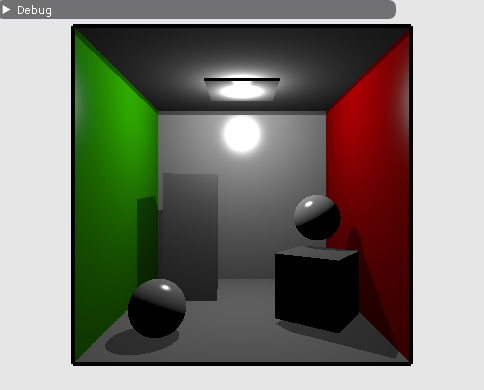
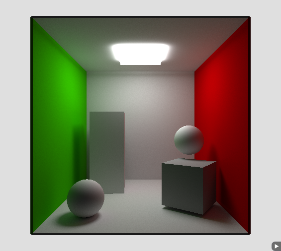

# NVIDIA Vulkan Ray Tracing Tutorial - glTF Scene

This example is the result of the modification of the [simple ray tracing](../ray_tracing__simple) tutorial.
Instead of loading separated OBJ objects, the example was modified to load glTF scene files containing multiple objects.

This example is not about shading, but using more complex data than OBJ.

## Scene Data

The OBJ models were loaded and stored in four buffers: 

* vertices: array of structure of position, normal, texcoord, color
* indices: index of the vertex, every three makes a triangle
* materials: the wavefront material structure
* material index: material index per triangle.

Since we could have multiple OBJ, we would have arrays of those buffers.

With glTF scene, the data will be organized differently a choice we have made for convenience. Instead of having structure of vertices,  
positions, normals and other attributes will be in separate buffers. There will be one single position buffer,
for all geometries of the scene, same for indices and other attributes. But for each geometry there is the information
of the number of elements and offsets. 

From the source tutorial, we will not need the following and therefore remove it:

~~~~C
  struct ObjModel          {..};
  struct ObjInstance       {..};
  std::vector<ObjModel>    m_objModel;
  std::vector<ObjInstance> m_objInstance;
  nvvk::Buffer             m_sceneDesc;  // Device buffer of the OBJ instances
~~~~

But instead, we will use this following structure to retrieve the information of the primitive that has been hit in the closest hit shader;

~~~~C
  // Structure used for retrieving the primitive information in the closest hit
  // The gl_InstanceCustomIndexNV
  struct RtPrimitiveLookup
  {
    uint32_t indexOffset;
    uint32_t vertexOffset;
    int      materialIndex;
  };
 ~~~~

 And for holding the information, we will be using a helper class to hold glTF scene and buffers for the data.

 ~~~~C
  nvh::GltfScene m_gltfScene;
  nvvk::Buffer   m_vertexBuffer;
  nvvk::Buffer   m_normalBuffer;
  nvvk::Buffer   m_uvBuffer;
  nvvk::Buffer   m_indexBuffer;
  nvvk::Buffer   m_materialBuffer;
  nvvk::Buffer   m_matrixBuffer;
  nvvk::Buffer   m_rtPrimLookup;
~~~~

## Loading glTF scene

To load the scene, we will be using [TinyGLTF](https://github.com/syoyo/tinygltf) from Syoyo Fujita, then to avoid traversing 
the scene graph, the information will be flatten using the helper [gltfScene](https://github.com/nvpro-samples/shared_sources/tree/master/nvh#gltfscenehpp).

### Loading Scene

Instead of loading a model, we will be loading a scene, so we are replacing `loadModel()` by `loadScene()`.

In the source file, loading the scene `loadScene()` will have first the glTF import with TinyGLTF.

~~~~C
  tinygltf::Model    tmodel;
  tinygltf::TinyGLTF tcontext;
  std::string        warn, error;

  if(!tcontext.LoadASCIIFromFile(&tmodel, &error, &warn, filename))
    assert(!"Error while loading scene");
~~~~

Then we will flatten the scene graph and grab the information we will need using the gltfScene helper.

~~~~C
  m_gltfScene.importMaterials(tmodel);
  m_gltfScene.importDrawableNodes(tmodel,
                                  nvh::GltfAttributes::Normal | nvh::GltfAttributes::Texcoord_0);
~~~~

The next par is to allocate the buffers to hold the information, such as the positions, normals, texture coordinates, etc.

~~~~C
  m_vertexBuffer =
      m_alloc.createBuffer(cmdBuf, m_gltfScene.m_positions,
                           vkBU::eVertexBuffer | vkBU::eStorageBuffer | vkBU::eShaderDeviceAddress);
  m_indexBuffer =
      m_alloc.createBuffer(cmdBuf, m_gltfScene.m_indices,
                           vkBU::eIndexBuffer | vkBU::eStorageBuffer | vkBU::eShaderDeviceAddress);
  m_normalBuffer   = m_alloc.createBuffer(cmdBuf, m_gltfScene.m_normals,
                                        vkBU::eVertexBuffer | vkBU::eStorageBuffer);
  m_uvBuffer       = m_alloc.createBuffer(cmdBuf, m_gltfScene.m_texcoords0,
                                    vkBU::eVertexBuffer | vkBU::eStorageBuffer);
  m_materialBuffer = m_alloc.createBuffer(cmdBuf, m_gltfScene.m_materials, vkBU::eStorageBuffer);
~~~~

We could use `push_constant` to set the matrix of the node, but instead, we will push the index of the 
node to draw and fetch the matrix from a buffer.

~~~~C
  std::vector<nvmath::mat4f> nodeMatrices;
  for(auto& node : m_gltfScene.m_nodes)
    nodeMatrices.emplace_back(node.worldMatrix);
  m_matrixBuffer = m_alloc.createBuffer(cmdBuf, nodeMatrices, vkBU::eStorageBuffer);
~~~~

To find the positions of the triangle hit in the closest hit shader, as well as the other 
attributes, we will store the offsets information of that geometry.

~~~~C
  // The following is used to find the primitive mesh information in the CHIT
  std::vector<RtPrimitiveLookup> primLookup;
  for(auto& primMesh : m_gltfScene.m_primMeshes)
    primLookup.push_back({primMesh.firstIndex, primMesh.vertexOffset, primMesh.materialIndex});
  m_rtPrimLookup =
      m_alloc.createBuffer(cmdBuf, primLookup, vk::BufferUsageFlagBits::eStorageBuffer);
~~~~

## Converting geometry to BLAS

Instead of `objectToVkGeometryKHR()`, we will be using `primitiveToGeometry(const nvh::GltfPrimMesh& prim)`.
The function is similar, only the input is different. 

~~~~C
//--------------------------------------------------------------------------------------------------
// Converting a GLTF primitive in the Raytracing Geometry used for the BLAS
//
nvvk::RaytracingBuilderKHR::Blas HelloVulkan::primitiveToGeometry(const nvh::GltfPrimMesh& prim)
{
  // Setting up the creation info of acceleration structure
  vk::AccelerationStructureCreateGeometryTypeInfoKHR asCreate;
  asCreate.setGeometryType(vk::GeometryTypeKHR::eTriangles);
  asCreate.setIndexType(vk::IndexType::eUint32);
  asCreate.setVertexFormat(vk::Format::eR32G32B32Sfloat);
  asCreate.setMaxPrimitiveCount(prim.indexCount / 3);  // Nb triangles
  asCreate.setMaxVertexCount(prim.vertexCount);
  asCreate.setAllowsTransforms(VK_FALSE);  // No adding transformation matrices

  // Building part
  vk::DeviceAddress vertexAddress = m_device.getBufferAddress({m_vertexBuffer.buffer});
  vk::DeviceAddress indexAddress  = m_device.getBufferAddress({m_indexBuffer.buffer});

  vk::AccelerationStructureGeometryTrianglesDataKHR triangles;
  triangles.setVertexFormat(asCreate.vertexFormat);
  triangles.setVertexData(vertexAddress);
  triangles.setVertexStride(sizeof(nvmath::vec3f));
  triangles.setIndexType(asCreate.indexType);
  triangles.setIndexData(indexAddress);
  triangles.setTransformData({});

  // Setting up the build info of the acceleration
  vk::AccelerationStructureGeometryKHR asGeom;
  asGeom.setGeometryType(asCreate.geometryType);
  asGeom.setFlags(vk::GeometryFlagBitsKHR::eNoDuplicateAnyHitInvocation);  // For AnyHit
  asGeom.geometry.setTriangles(triangles);

  vk::AccelerationStructureBuildOffsetInfoKHR offset;
  offset.setFirstVertex(prim.vertexOffset);
  offset.setPrimitiveCount(prim.indexCount / 3);
  offset.setPrimitiveOffset(prim.firstIndex * sizeof(uint32_t));
  offset.setTransformOffset(0);

  nvvk::RaytracingBuilderKHR::Blas blas;
  blas.asGeometry.emplace_back(asGeom);
  blas.asCreateGeometryInfo.emplace_back(asCreate);
  blas.asBuildOffsetInfo.emplace_back(offset);
  return blas;
}
~~~~

## Top Level creation

There are almost no changes for creating the TLAS but is actually even simpler. Each 
drawable node has a matrix and an index to the geometry, which in our case, also 
correspond directly to the BLAS ID. To know which geometry is used, and to find back 
all the data (see structure `RtPrimitiveLookup`), we will set the `instanceId` member 
to the primitive mesh id. This value will be recovered with `gl_InstanceCustomIndexEXT`
in the closest hit shader.

~~~~C
  for(auto& node : m_gltfScene.m_nodes)
  {
    nvvk::RaytracingBuilderKHR::Instance rayInst;
    rayInst.transform  = node.worldMatrix;
    rayInst.instanceId = node.primMesh;  // gl_InstanceCustomIndexEXT: to find which primitive
    rayInst.blasId     = node.primMesh;
    rayInst.flags      = VK_GEOMETRY_INSTANCE_TRIANGLE_FACING_CULL_DISABLE_BIT_KHR;
    rayInst.hitGroupId = 0;  // We will use the same hit group for all objects
    tlas.emplace_back(rayInst);
  }
~~~~

## Raster Rendering

Raster rendering is simple. The shader was changed to use vertex, normal and texture coordinates. For 
each node, we will be pushing the instance Id (retrieve the matrix) and the material Id. Since we 
don't have a scene graph, we could loop over all drawable nodes.

~~~~C
  std::vector<vk::Buffer> vertexBuffers = {m_vertexBuffer.buffer, m_normalBuffer.buffer,
                                           m_uvBuffer.buffer};
  cmdBuf.bindVertexBuffers(0, static_cast<uint32_t>(vertexBuffers.size()), vertexBuffers.data(),
                           offsets.data());
  cmdBuf.bindIndexBuffer(m_indexBuffer.buffer, 0, vk::IndexType::eUint32);

  uint32_t idxNode = 0;
  for(auto& node : m_gltfScene.m_nodes)
  {
    auto& primitive = m_gltfScene.m_primMeshes[node.primMesh];

    m_pushConstant.instanceId = idxNode++;
    m_pushConstant.materialId = primitive.materialIndex;
    cmdBuf.pushConstants<ObjPushConstant>(
        m_pipelineLayout, vk::ShaderStageFlagBits::eVertex | vk::ShaderStageFlagBits::eFragment, 0,
        m_pushConstant);
    cmdBuf.drawIndexed(primitive.indexCount, 1, primitive.firstIndex, primitive.vertexOffset, 0);
  }
~~~~

## Ray tracing change

In `createRtDescriptorSet()`, the only change we will add is the primitive info buffer to retrieve 
the data when hitting a triangle. 

~~~~C
m_rtDescSetLayoutBind.addBinding(
      vkDSLB(2, vkDT::eStorageBuffer, 1, vkSS::eClosestHitNV | vkSS::eAnyHitNV));  // Primitive info
....
vk::DescriptorBufferInfo primitiveInfoDesc{m_rtPrimLookup.buffer, 0, VK_WHOLE_SIZE};
....
writes.emplace_back(m_rtDescSetLayoutBind.makeWrite(m_rtDescSet, 2, &primitiveInfoDesc));
~~~~

## Descriptors and Pipeline Changes

Since we are using different buffers and the vertex is no longer a struct but is using 
3 different buffers for the position, normal and texture coord. 
The methods `createDescriptorSetLayout()`, `updateDescriptorSet()` and `createGraphicsPipeline()`
will be changed accordingly.

See [hello_vulkan](hello_vulkan.cpp)

## Shaders

The shading is the same and is not reflecting the glTF PBR shading model, but the shaders were nevertheless 
changed to fit the new incoming format. 

* Raster : [vertex](shaders/vert_shader.vert), [fragment](shaders/frag_shader.frag)
* Ray Trace: [RayGen](shaders/raytrace.rgen), [ClosestHit](shaders/raytrace.rchit)

## Other changes

Small other changes were done, a different scene, different camera and light position.

Camera position
~~~~C
  CameraManip.setLookat(nvmath::vec3f(0, 0, 15), nvmath::vec3f(0, 0, 0), nvmath::vec3f(0, 1, 0));
~~~~

Scene
~~~~C
  helloVk.loadScene(nvh::findFile("media/scenes/cornellBox.gltf", defaultSearchPaths));
~~~~

Light Position
~~~~C
    nvmath::vec3f lightPosition{0.f, 4.5f, 0.f};
~~~~

# Simple Path Tracing

To convert this example to a simple path tracer (see Wikipedia [Path Tracing](https://en.wikipedia.org/wiki/Path_tracing)), we need to change the `RayGen` and the `ClosestHit` shaders.
Before doing this, we will modify the application to send the current rendering frame, allowing to accumulate
samples.

Add the following two functions in `hello_vulkan.cpp`:

~~~~C
//--------------------------------------------------------------------------------------------------
// If the camera matrix has changed, resets the frame.
// otherwise, increments frame.
//
void HelloVulkan::updateFrame()
{
  static nvmath::mat4f refCamMatrix;

  auto& m = CameraManip.getMatrix();
  if(memcmp(&refCamMatrix.a00, &m.a00, sizeof(nvmath::mat4f)) != 0)
  {
    resetFrame();
    refCamMatrix = m;
  }
  m_rtPushConstants.frame++;
}

void HelloVulkan::resetFrame()
{
  m_rtPushConstants.frame = -1;
}
~~~~

And call `updateFrame()` in the begining of the `raytrace()` function.

In `hello_vulkan.cpp`, add the function declarations

~~~~C
  void updateFrame();
  void resetFrame();
~~~~

And add a new `frame` member at the end of `RtPushConstant` structure.

## Ray Generation

There are a few modifications to be done in the ray generation. First, it will use the clock for its random seed number.

This is done by adding the [`GL_ARB_shader_clock`](https://www.khronos.org/registry/OpenGL/extensions/ARB/ARB_shader_clock.txt) extension.

~~~~C
#extension GL_ARB_shader_clock : enable
~~~~

The random number generator is in `sampling.glsl`, `#include` this file.

In `main()`, we will initialize the random number like this: (see tutorial on jitter camera)

~~~~C
  // Initialize the random number
  uint seed = tea(gl_LaunchIDEXT.y * gl_LaunchSizeEXT.x + gl_LaunchIDEXT.x, int(clockARB()));
~~~~

To accumulate the samples, instead of only write to the image, we will also use the previous frame.

~~~~C
  // Do accumulation over time
  if(pushC.frame > 0)
  {
    float a         = 1.0f / float(pushC.frame + 1);
    vec3  old_color = imageLoad(image, ivec2(gl_LaunchIDEXT.xy)).xyz;
    imageStore(image, ivec2(gl_LaunchIDEXT.xy), vec4(mix(old_color, prd.hitValue, a), 1.f));
  }
  else
  {
    // First frame, replace the value in the buffer
    imageStore(image, ivec2(gl_LaunchIDEXT.xy), vec4(prd.hitValue, 1.f));
  }
~~~~

Extra information will be needed in the ray payload `hitPayload`, the `seed` and the `depth`.

The modification in `raycommon.glsl`
~~~~C
struct hitPayload
{
  vec3 hitValue;
  uint seed;
  uint depth;
};
~~~~

## Closest Hit Shader

This modification will recursively trace until the `depth`hits 10 (hardcoded) or hit an emissive element (light).

The only information that we will keep from the shader, is the calculation of the hit state: position, normal. So
all code from `// Vector toward the light` to the end can be remove and be replaced by the following.

~~~~C
  // https://en.wikipedia.org/wiki/Path_tracing
  // Material of the object
  GltfMaterial mat       = materials[nonuniformEXT(matIndex)];
  vec3         emittance = mat.emissiveFactor;

  // Pick a random direction from here and keep going.
  vec3 tangent, bitangent;
  createCoordinateSystem(world_normal, tangent, bitangent);
  vec3 rayOrigin    = world_position;
  vec3 rayDirection = samplingHemisphere(prd.seed, tangent, bitangent, world_normal);

  // Probability of the newRay (cosine distributed)
  const float p = 1 / M_PI;

  // Compute the BRDF for this ray (assuming Lambertian reflection)
  float cos_theta = dot(rayDirection, world_normal);
  vec3  BRDF      = mat.pbrBaseColorFactor.xyz / M_PI;

  // Recursively trace reflected light sources.
  if(prd.depth < 10)
  {
    prd.depth++;
    float tMin  = 0.001;
    float tMax  = 100000000.0;
    uint  flags = gl_RayFlagsOpaqueEXT;
    traceRayEXT(topLevelAS,    // acceleration structure
                flags,         // rayFlags
                0xFF,          // cullMask
                0,             // sbtRecordOffset
                0,             // sbtRecordStride
                0,             // missIndex
                rayOrigin,     // ray origin
                tMin,          // ray min range
                rayDirection,  // ray direction
                tMax,          // ray max range
                0              // payload (location = 0)
    );
  }
  vec3 incoming = prd.hitValue;

  // Apply the Rendering Equation here.
  prd.hitValue = emittance + (BRDF * incoming * cos_theta / p);
~~~~

## Miss Shader

To avoid contribution from the environment.

~~~~C
void main()
{
  if(prd.depth == 0)
    prd.hitValue = clearColor.xyz * 0.8;
  else
    prd.hitValue = vec3(0.01);  // Tiny contribution from environment
  prd.depth = 100;              // Ending trace
}
~~~~

# Faster Path Tracer

The implementation above is recursive and this is really not optimal. As described in the [reflection](../vk_ray_tracing_reflection) 
tutorial, the best is to break the recursivity and do most of the work in the `RayGen`.

The following change can give up to **3 time faster** rendering.

To be able to do this, we need to extend the ray `payload` to bring data from the `Closest Hit` to the `RayGen`, which is the 
ray origin and direction and the BRDF weight. 

~~~~C
struct hitPayload
{
  vec3 hitValue;
  uint seed;
  uint depth;
  vec3 rayOrigin;
  vec3 rayDirection;
  vec3 weight;
};
~~~~

## Closest Hit

We don't need to trace anymore, so before tracing a new ray, we can store the information in 
the `payload` and return before the recursion code.

~~~~C
  prd.rayOrigin    = rayOrigin;
  prd.rayDirection = rayDirection;
  prd.hitValue     = emittance;
  prd.weight       = BRDF * cos_theta / p;
  return;
~~~~

## Ray Generation

The ray generation is the one that will do the trace loop. 

First initialize the `payload` and variable to compute the accumulation.

~~~~C
  prd.rayOrigin    = origin.xyz;
  prd.rayDirection = direction.xyz;
  prd.weight       = vec3(0);

  vec3 curWeight = vec3(1);
  vec3 hitValue  = vec3(0);
~~~~

Now the loop over the trace function, will be like the following.

**Note:** the depth is hardcode, but could be a parameter to the `push constant`.

~~~~C
  for(; prd.depth < 10; prd.depth++)
  {
    traceRayEXT(topLevelAS,        // acceleration structure
                rayFlags,          // rayFlags
                0xFF,              // cullMask
                0,                 // sbtRecordOffset
                0,                 // sbtRecordStride
                0,                 // missIndex
                prd.rayOrigin,     // ray origin
                tMin,              // ray min range
                prd.rayDirection,  // ray direction
                tMax,              // ray max range
                0                  // payload (location = 0)
    );

    hitValue += prd.hitValue * curWeight;
    curWeight *= prd.weight;
  }
~~~~

**Note:** do not forget to use `hitValue` in the `imageStore`.

